# Architecture Diagram

## Lab Infrastructure Overview

## Workflow Execution Flow

## Network Communication

```mermaid
graph LR
    subgraph "Security Group Rules"
        direction TB
        IN["Inbound Rules"]
        OUT["Outbound Rules"]
    end

    subgraph "Allowed Traffic"
        SSH["SSH (22)<br/>Source: Same SG<br/>For runner → targets"]
        HTTPS["HTTPS (443)<br/>Destination: 0.0.0.0/0<br/>For GitHub API"]
    end

    IN -.-> SSH
    OUT -.-> SSH
    OUT -.-> HTTPS

    style IN fill:#e1f5fe,color:#000
    style OUT fill:#fff3e0,color:#000
    style SSH fill:#c8e6c9,color:#000
    style HTTPS fill:#c8e6c9,color:#000
```

## Workflow Categories

## Data Flow

## Component Details

### Self-hosted Runner
- **OS**: Ubuntu/Amazon Linux 2
- **Role**: Executes GitHub Actions workflows
- **Access**: 
  - Outbound HTTPS (443) to GitHub
  - Outbound SSH (22) to target hosts
  - Uses SSH key authentication

### Target Hosts
- **OS**: Ubuntu Server
- **Deployed Components**:
  - Smart Agent (`/opt/appdynamics/`)
  - AppDynamics Agents (node, machine, db, java)
- **Access**: 
  - Inbound SSH (22) from runner only
  - Private IP communication only

### GitHub Repository
- **Stores**:
  - 11 workflow YAML files
  - Smart Agent installation package
  - Configuration file (config.ini)
- **Secrets**: SSH private key
- **Variables**: Host list, user/group settings

## Scaling Considerations

## Batched Workflow Architecture

### How It Works

### Why Sequential Batches?

**Resource Management:**
- Prevents overwhelming the self-hosted runner
- Each batch opens 256 parallel SSH connections
- Sequential processing ensures stable performance

**Configurable:**
- Default batch size: 256 (GitHub Actions matrix limit)
- Adjustable via workflow input for smaller batches
- Balance between speed and resource usage

---

**Note**: All diagrams are written in Mermaid syntax and will render automatically on GitHub.
